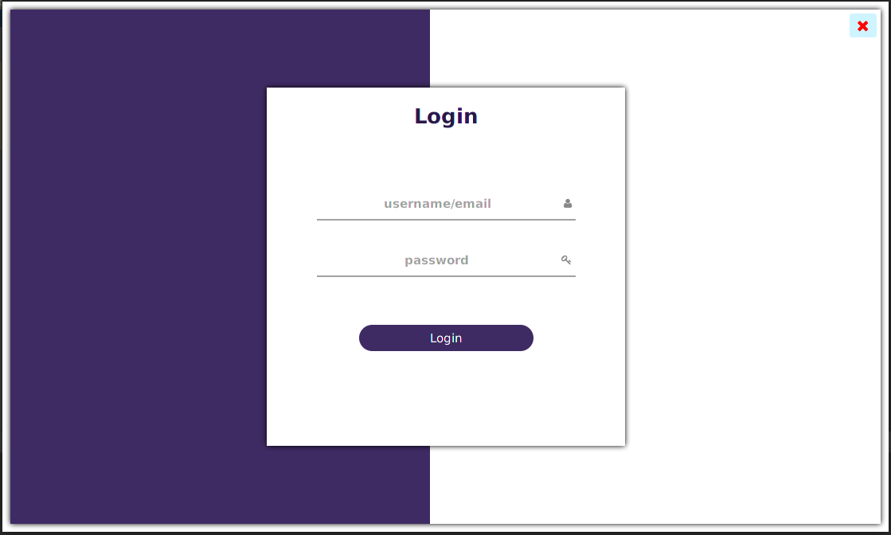
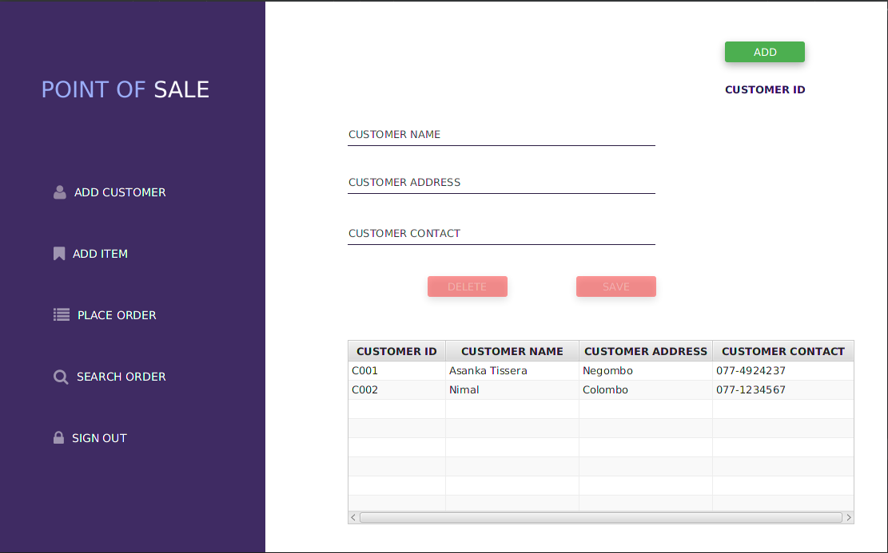
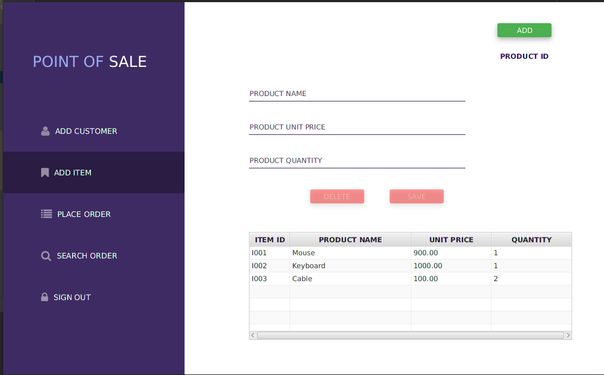
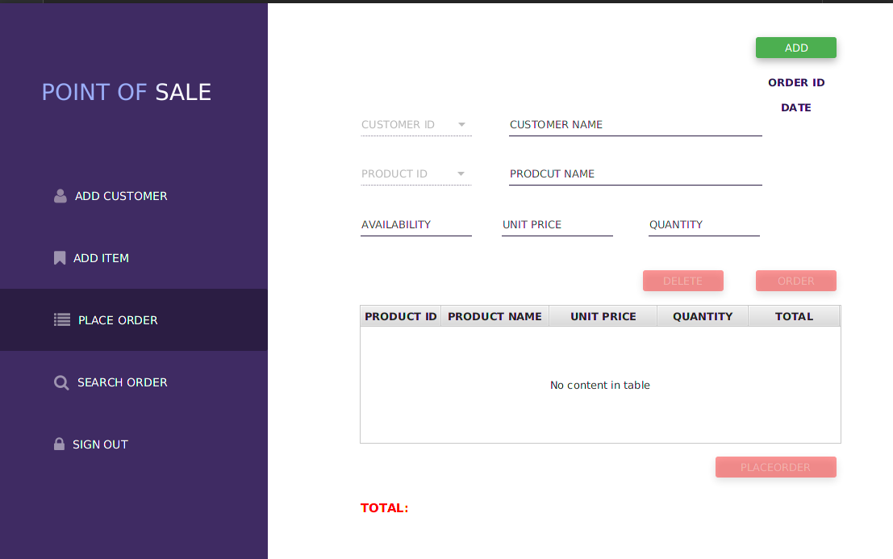
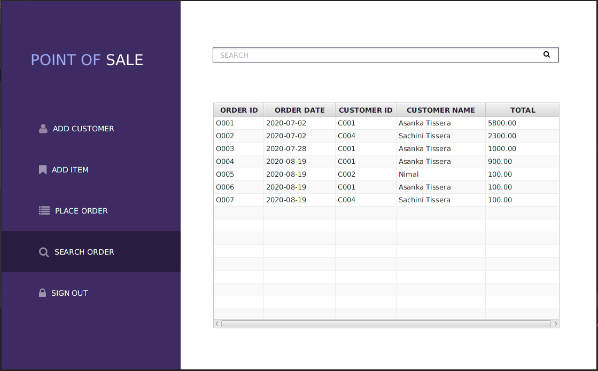

# POS System With JDBC

In this **POS System** has all the functionalities of a pos system, like customer adding,item management,order placing,order viewing and order searching.It consists of five main parts;

    * Manage customers
    * Manage items
    * Placeorders
    * View orders
    * Search orders
    
This system has developed by using Java, JDBC and MySQL.

Java Database Connectivity (JDBC) is an application programming interface (API) for the programming language 
Java, which defines how a client may access a database. It is a Java-based data access technology used for 
Java database connectivity. It is part of the Java Standard Edition platform, from Oracle Corporation.   
    
Further this POS System has implemented by using various technologies and frameworks.Click above link to check those implementations.

[Different Implementations of POS System](https://github.com/LawrenceAsanka/Point-of-Sale-System/blob/master/README.md)

#### Login

#### Customer Management

#### Item Management

#### Place Order

#### Search Order

## Requirements

* Before use this application you must need to install [JAVA](https://www.oracle.com/java/technologies/javase/javase-jdk8-downloads.html) runtime environment and [MYSQL](https://www.mysql.com/) database management services.

#### Required JAR files
* [JFoenix](http://www.jfoenix.com/) - is an open source Java library, that implements Google Material Design using Java components
* [FontAwesomeFX-8.2](https://bitbucket.org/Jerady/fontawesomefx/downloads/) - FontAwesomeFX is an open source library adding Web Icons support to your JavaFX Apps! Including FontAwesome, WeatherIcons, Google Material Icons.
* [MySQL Connector](https://dev.mysql.com/downloads/connector/j/) - MySQL Connector/J is the official JDBC driver for MySQL.

## Installation

 1. Clone or Download the repository.
 2. Create a Database using [script.sql](script.sql) file.
 3. Download the required library files.
 4. Create a lib file inside the project directory and copy those jar files into that.
 5. Find Database Configuration From src/dbConnection, and set your Database name,user name and password.
 6. Test it!.
 
## Features

 
## Contributing
Pull requests are welcome. For major changes, please open an issue first to discuss what you would like to change.
Please make sure to update tests as appropriate.

## License
Distributed under the MIT License. See [License](LICENSE) for more information.

